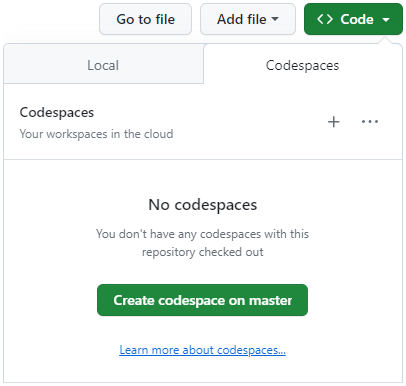

# Remill Workshop

## Setting up the environment

This repository uses a [`devcontainer.json`](./.devcontainer/devcontainer.json) file to allow you to quickly get started. Below are two methods of setting up the environment. **Using Codespaces is recommended**.

### GitHub Codespaces (easy)

1. Login to your GitHub account
2. Fork this repository
3. Click the green `<> Code` button
4. Select `Codespaces`
5. Click `Create codespace on master`
6. Wait a few minutes while the image is loading ☕



### Docker Desktop (tricky)

- Install/Update [Docker Desktop](https://www.docker.com/products/docker-desktop/) ([alternatives](https://code.visualstudio.com/remote/advancedcontainers/docker-options))
- **Start Docker Desktop**
- Install [Visual Studio Code](https://code.visualstudio.com)
- Clone and open this repository in VS Code (**use the HTTPS protocol**)
- Install the [Dev Containers](vscode:extension/ms-vscode-remote.remote-containers) extension in VS Code (you should be prompted for recommended extensions)
- Click the blue 'Reopen in Container' button when prompted (you can also find it in the command palette)

For more detailed steps, check out the [Dev Containers tutorial](https://code.visualstudio.com/docs/devcontainers/tutorial). The instructions after this assume you are running _inside_ the container.

#### Windows

Because the host filesystem is mounted inside the container you need to configure Git to not automatically convert line endings:

```sh
git config --global core.autocrlf false
```

Additionally it's recommended to configure Docker to use the WSL 2 backend.

## Building the examples

To build the examples, use the following commands from VSCode's command palette (Meta+Shift+P):

- `CMake: Configure`
- `CMake: Build` (select the `[Unspecified]` kit when prompted)

## Activating the environment

Open a New Terminal and activate the environment with the following command:

```sh
source llvm-env
```

To verify, run the following command:

```sh
llvm-config --prefix
```

Expected output:

> /cxx-common/install

The `${workspaceFolder}/build` directory will also be added to your `PATH`, so you can easily access your tools from anywhere. To verify, run the follow command:

```sh
hello
```

Output:

> remill version: e72a100
