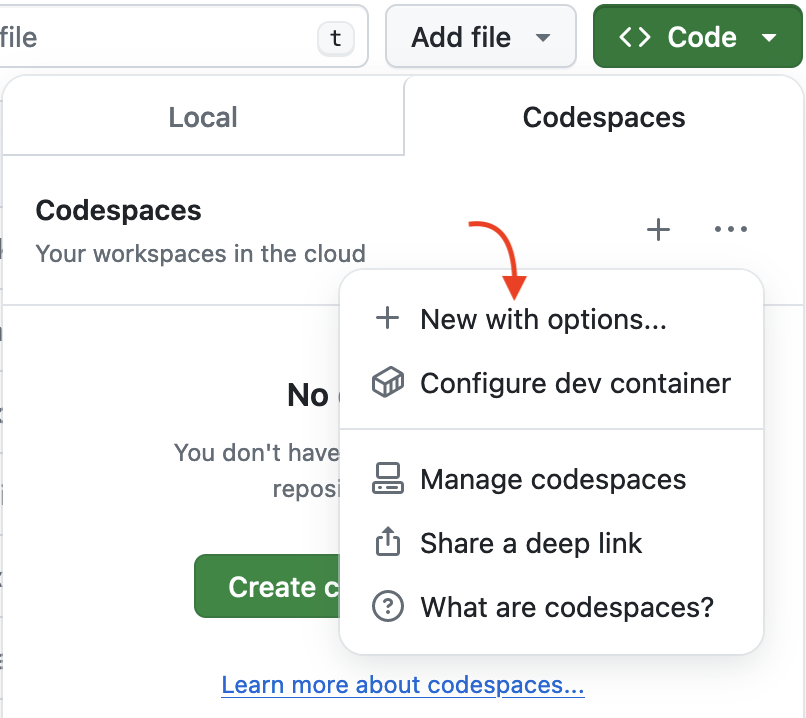
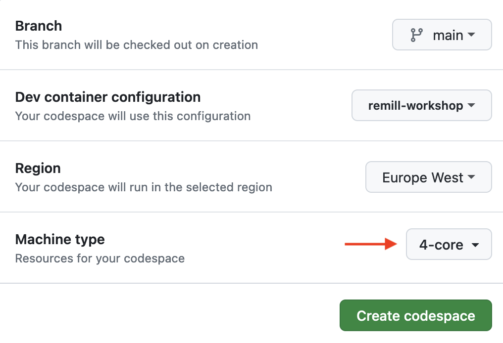
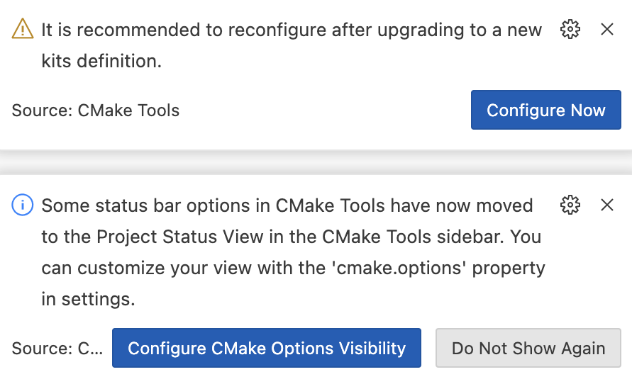
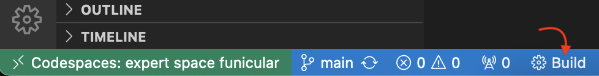
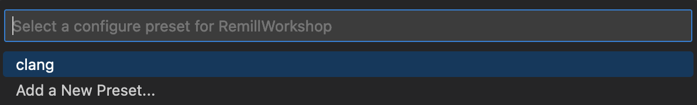

# Remill Workshop

## Setting up the environment

This repository uses a [`devcontainer.json`](./.devcontainer/devcontainer.json) file to allow you to quickly get started. Below are two methods of setting up the environment. **Using Codespaces is recommended**.

### 1) GitHub Codespaces (easy)

1. Login to your GitHub account
2. [Fork this repository](https://github.com/LLVMParty/RemillWorkshop/fork)
3. Click the green `<> Code` button
4. Press `...` and then `New with options...`
5. Change `Machine type` to `4-core`
6. Then `Create codespace`
7. Wait a ~3 minutes while the image is loading ☕
   - Press `Show log` to see progress

|  |  |
|---|---|

#### **Remember to shut down your codespace [here](https://github.com/codespaces) when you're finished.**

I recommend switching to the `GitHub Dark` theme, because the LLVM IR syntax highlighting works better there. When prompted by the CMake tools, just close the notifications:



<sub>_Alternatively you can set things up locally with Docker Desktop_ (**not recommended**):</sub>
<details>

### Docker Desktop (tricky)

- Install/Update [Docker Desktop](https://www.docker.com/products/docker-desktop/) ([alternatives](https://code.visualstudio.com/remote/advancedcontainers/docker-options))
- **Start Docker Desktop**
- Install [Visual Studio Code](https://code.visualstudio.com)
- Clone and open this repository in VS Code (**use the HTTPS protocol**)
- Install the [Dev Containers](vscode:extension/ms-vscode-remote.remote-containers) extension in VS Code (you should be prompted for recommended extensions)
- Click the blue 'Reopen in Container' button when prompted (you can also find it in the command palette)

For more detailed steps, check out the [Dev Containers tutorial](https://code.visualstudio.com/docs/devcontainers/tutorial). The instructions after this assume you are running _inside_ the container.

#### Windows

Because the host filesystem is mounted inside the container you _may_ need to configure Git to not automatically convert line endings:

```sh
git config --global core.autocrlf false
```

Additionally it's recommended to configure Docker to use the WSL 2 backend.

</details>

## 2) Building the examples

To build the project, press the `Build` button in the status bar:



You will be prompted for a preset, select `clang` and the build will start:



Alternatively you can build with the following commands:

```sh
cmake --preset clang
cmake --build build
```

## 3) Checking the environment

To verify if the environment is set up correctly, run:

```sh
llvm-config --prefix
```

Expected output:

> `/cxx-common/install`

The `${workspaceFolder}/build` directory will also be added to your `PATH`, so you can easily access your tools from anywhere. To verify, run the follow command:

```sh
remill-lift --version
```

Expected output:

```
remill-lift version v4.1.0-160-g7f091d4
Commit Hash: 7f091d4256060c254fcd15f35fd8b9bd6abd157f
Commit Date: 2024-07-17 12:32:00 -0400
Last commit by: Duncan Ogilvie [mr.exodia.tpodt@gmail.com]
Commit Subject: [Remove [[gnu::const]] (readnone) from __remill intrinsics (#710)]
```
