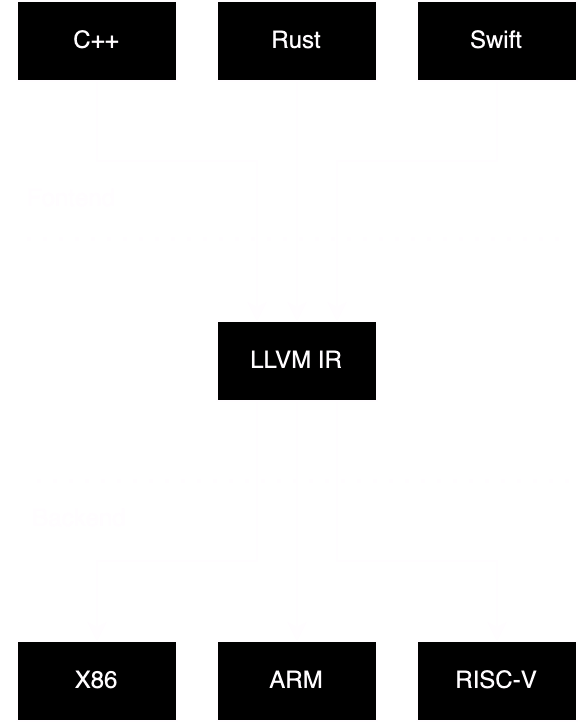
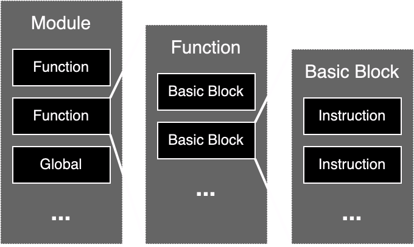

<style scoped>
section {
    text-align: center;
}
</style>

# Workshop: LLVM for Reverse Engineers

 
<br><br><br><br><br><br><br><br>
_Duncan Ogilvie_

---

<!-- paginate: true -->

# Setup: [workshop.ogilvie.pl](https://workshop.ogilvie.pl)

<br>

1. Login to your GitHub account
2. [Fork the repository](https://github.com/LLVMParty/RemillWorkshop/fork)
3. Click the green `<> Code` button
4. Press `...` and then `New with options...`
5. Change `Machine type` to `4-core`
6. Then `Create codespace`
7. Wait a ~3 minutes while the image is loading ☕
   - Press `Show log` to see progress

---

# Introduction

- Meant for absolute (LLVM) beginners
  - **C(++) programming experience absolutely required!**
  - Additionally you need basic reverse engineering knowledge
- Format: hands-on workshop
- Interactive
- Available for on-site training: [`training@ogilvie.pl`](mailto:training@ogilvie.pl)

---

# Who am I?

- Creator of [x64dbg](https://x64dbg.com)
- Worked in DRM for 5 years
- Currently working in mobile security R&D

---

# Outline

- LLVM IR (1h30m)
- Coffee break (15m)
- Binary lifting (1h)
  - Time permitting

---

# What is LLVM IR?

- **L**ow **L**evel **V**irtual **M**achine ([paper](https://llvm.org/pubs/2002-08-09-LLVMCompilationStrategy.pdf))
  - Authors: Chris Lattner, Vikram Adve (2002)
  - Meant for compiler development
- **I**ntermediate **R**epresentation (IR)
  - Platform agnostic (mostly)
  - Functions, basic blocks, control flow, etc.
  - **R**educed **I**nstruction **S**et **C**omputer ('RISC')
  - **S**ingle **S**tatic **A**ssignment (SSA)
- Reusable optimization/code generation pipeline



---

# Why LLVM IR?

- Lifting
  - Deobfuscation
  - Emulation
  - Binary rewriting <!-- security checks, asan, cross-platform porting -->
- Fuzzing/analysis (vulnerability research)
- Obfuscation

<br>

_Note_: tame your expectations.

---

# LLVM IR: Module

- Functions
  - Basic Blocks
    - Instructions ([reference](https://llvm.org/docs/LangRef.html))
- Globals (variables)
- Metadata



---

# LLVM IR: Hello World

**C**:

```c
int hello(int x, int y) {
  return x + y;
}
```

**LLVM IR**:

```llvm
define i32 @hello(i32 %0, i32 %1) {
2: ; entry block label (optional)
  %3 = add i32 %0, %1
  ret i32 %3
}
```

- Identifiers: `@global`, `%local`
- No signed/unsigned number types
- [Implicit numbering](https://godbolt.org/z/zjEY6j1YE) vs [explicit naming](https://godbolt.org/z/Kr3W85hYf) of _values_

---

# LLVM IR: Clang

[**hello.c**](https://godbolt.org/z/nn8P6xE14):

```llvm
define dso_local i32 @hello(i32 noundef %0, i32 noundef %1) #0 {
  %3 = alloca i32, align 4
  %4 = alloca i32, align 4
  store i32 %0, ptr %3, align 4
  store i32 %1, ptr %4, align 4
  %5 = load i32, ptr %3, align 4
  %6 = load i32, ptr %4, align 4
  %7 = add i32 %5, %6
  ret i32 %7
}

attributes #0 = { noinline nounwind optnone uwtable ... }
```

- `dso_local`: [Runtime Preemption Specifier](https://llvm.org/docs/LangRef.html#runtime-preemption-specifiers) (always emitted by Clang)
- `noundef`: [Parameter attribute](https://llvm.org/docs/LangRef.html#parameter-attributes) to indicate the value is always defined
- `attributes`: [Group](https://llvm.org/docs/LangRef.html#attribute-groups) of [function attributes](https://llvm.org/docs/LangRef.html#function-attributes)

---

# LLVM IR: Single Static Assignment (SSA)

- Local _values_ are defined, not assigned
  - _Variable_ is a misnomer
  - Also called _registers_
- You cannot define the same value twice
- Does not apply to memory
  - The `load` and `store` instructions operate on `ptr` values

---

<!-- Reduce the size of the code to fit the slide -->
<style scoped>
pre {
  font-size: 0.7em;
}
</style>

# LLVM IR: Control Flow

[`cfg_alloca.ll`](https://godbolt.org/z/az5GoTz5W):

```c
uint32_t cfg(uint32_t x) {
  if (x > 10) return 123;
  else        return 321;
}
```

```llvm
define i32 @cfg(i32 %x) {
  %temp = alloca i32, align 4
  %cond = icmp ugt i32 %x, 10
  br i1 %cond, label %bb_if, label %bb_else
bb_if:      ; preds = %entry, x > 10
  store i32 123, ptr %temp, align 4
  br label %bb_end
bb_else:    ; preds = %entry, !(x > 10)
  store i32 321, ptr %temp, align 4
  br label %bb_end
bb_end:     ; preds = %bb_if, %bb_else
  %result = load i32, ptr %temp, align 4
  ret i32 %result
}
```

---

# LLVM IR: `phi`

[`cfg_phi.ll`](https://godbolt.org/z/76xWWKnfr):

```llvm
define i32 @cfg(i32 %x) {
  %cond = icmp ugt i32 %x, 10
  br i1 %cond, label %bb_if, label %bb_else
bb_if:      ; preds = %entry, x > 10
  %result_if = add i32 0, 123
  br label %bb_end
bb_else:    ; preds = %entry, !(x > 10)
  %result_else = add i32 0, 321
  br label %bb_end
bb_end:     ; preds = %bb_if, %bb_else
  %result = phi i32 [%result_if, %bb_if], [%result_else, %bb_else]
  ret i32 %result
}
```

Simplifies analysis/optimization passes.

---

# LLVM IR: `select` (ternary)

[`cfg_select.ll`](https://godbolt.org/z/haef8ojsa):

```llvm
define i32 @cfg(i32 %x) {
  %cond = icmp ugt i32 %x, 10
  %result = select i1 %cond, i32 123, i32 321
  ret i32 %result
}
```

<br>

```c
uint32_t cfg(uint32_t x) {
  return (x > 10) // cond
    ? 123
    : 321
}
```

---

# LLVM IR: Exercises (part 1)

<br>

_Instructions_: `exercises/1_llvmir/README.md` (Exercise 1a-1d)

---

# LLVM IR: [`getelementptr`](https://llvm.org/docs/GetElementPtr.html)

- Purpose: pointer arithmetic
  - Arrays
  - Structs
  - Used absolutely everywhere
- **Does not** read memory
- [Most confusing](https://blog.yossarian.net/2020/09/19/LLVMs-getelementptr-by-example)
  - Similar to the x86 `lea` instruction

---

# LLVM IR: `getelementptr` (array)

**C**:

```c
uint32_t arrayExample(uint32_t* arr) {
  return arr[5];
}
```

**LLVM IR**:

```llvm
define i32 @arrayExample(ptr %arr) #0 {
  %ptr_idx_5 = getelementptr i32, ptr %arr, i64 5
  %result = load i32, ptr %ptr_idx_5
  ret i32 %result
}
```

- `ptr_idx_5 = (uintptr_t)arr + 5 * sizeof(i32)`

---

# LLVM IR: `getelementptr` (member)

**C**:

```c
typedef struct { uint64_t a[2]; uint32_t b; uint32_t c[5]; } MyStruct;

uint32_t structExample1(MyStruct* s) {
  return s->b; // s[0].b
}
```

**LLVM IR**:

```llvm
%struct.MyStruct = type { [2 x i64], i32, [5 x i32] }

define i32 @structExample1(ptr %s) #0 {
  %ptr_b = getelementptr %struct.MyStruct, ptr %s, i32 0, i32 1
  %result = load i32, ptr %ptr_b
  ret i32 %result
}
```

- `ptr_b = (uintptr_t)s + 0 * sizeof(MyStruct) + offsetof(MyStruct, b)`

---

# LLVM IR: `getelementptr` (member array)

**C**:

```c
typedef struct { uint64_t a[2]; uint32_t b; uint32_t c[5]; } MyStruct;

uint32_t structExample2(MyStruct* s) {
  return s->c[3];
}
```

**LLVM IR**:

```llvm
%struct.MyStruct = type { [2 x i64], i32, [5 x i32] }

define i32 @structExample2(ptr %s) #0 {
  %ptr_c = getelementptr %struct.MyStruct, ptr %s, i32 0, i32 2
  %ptr_c_3 = getelementptr [5 x i32], ptr %ptr_c, i32 0, i32 3
  %result = load i32, ptr %ptr_c_3
  ret i32 %result
}
```

<!-- Note: here it's also possible to collapse the [5 x i32] into i32 -->

---

# LLVM IR: `getelementptr` (optimization)

```llvm
%struct.MyStruct = type { [2 x i64], i32, [5 x i32] }

define i32 @structExample2(ptr %s) #0 {
  %ptr_c = getelementptr %struct.MyStruct, ptr %s, i32 0, i32 2
  %ptr_c_3 = getelementptr [5 x i32], ptr %ptr_c, i32 0, i32 3
  %result = load i32, ptr %ptr_c_3
  ret i32 %result
}

define i32 @structExample2_opt(ptr %s) #0 {
  %ptr_c_3 = getelementptr %struct.MyStruct, ptr %s, i32 0, i32 2, i32 3
  %result = load i32, ptr %ptr_c_3
  ret i32 %result
}
```

---

# LLVM IR: `getelementptr` (flattening)

```llvm
%struct.MyStruct = type { [2 x i64], i32, [5 x i32] }

define i64 @structExample3(ptr %s) #0 {
  %ptr_a = getelementptr %struct.MyStruct, ptr %s, i32 0, i32 0
  %ptr_a_1 = getelementptr [2 x i64], ptr %ptr_a, i32 0, i32 1
  %result = load i64, ptr %ptr_a_1
  ret i64 %result
}

define i64 @structExample3_opt(ptr %s) #0 {
  ; No reference to MyStruct at all anymore
  %ptr_a_1 = getelementptr [2 x i64], ptr %s, i64 0, i64 1
  %result = load i64, ptr %ptr_a_1
  ret i64 %result
}
```

- [LLVM IR Godbolt](https://godbolt.org/z/4KvzT9has)
- [C Godbolt](https://godbolt.org/z/1YKqE4Wsd) (play with the optimization settings)

---

# LLVM IR: Exercises (part 2)

<br>

_Instructions_: `exercises/1_llvmir/README.md` (Exercise 2a)

---

# Quick break (15 min)

<br>

# ☕️ 🍵

---

# What is Remill?

- Authors: Trail of Bits (2015)
- _Lifts_ native instructions to LLVM IR
  - Applications: binary analysis/instrumentation/emulation
  - Architectures: ARM, X86, PPC, SPARC, _Sleigh_
- Mild abuse of the IR, requires some tricks

---

# Remill: Concepts

- Instruction semantics in C++
  - Easier to maintain
  - Compiled to LLVM IR
- `State*` structure -> CPU Registers
- `Memory*` pointer -> memory manager
  - Total ordering to preserve semantics
- 'Massaging' required

---

# Remill: Instruction Semantics

Semantics of the x86 `mov` instruction:

```cpp
template <typename D, typename S>
DEF_SEM(MOV, D dst, const S src) {
  WriteZExt(dst, Read(src));
  return memory;
}

DEF_ISEL(MOV_GPRv_MEMv_32) = MOV<R32W, M32>;
```

<br><br>

🧙🏻‍♂️🪄✨

<!-- How it looks internally, vs other projects it's another abstraction layer -->

---

# Remill: Lifting Basic Blocks

Basic Block Definition:

```cpp
Memory *__remill_basic_block(State &state, Ptr block_addr, Memory *memory);
```

<br>

- Calls to the semantics are inserted here.
- State is fully symbolic
- Requires additional work to restore the calling convention

---

# Remill: High level example

<br>

```cpp
Memory *__remill_basic_block(State &state, Ptr block_addr, Memory *memory) {
  // mov rax, rdi
  state.rax = state.rdi;
  state.rip += 3;
  // ret
  state.rip = *(Ptr*)state.rsp;
  state.rsp += sizeof(Ptr);
  return __remill_function_return(state, state.rip, memory);
}
```

<!-- Pseudo-code, decompiled from IR -->

---

# Remill: Helpers

```cpp
Memory *__remill_write_memory_8(Memory *m, addr_t a, uint8_t v);
Memory *__remill_write_memory_16(Memory *m, addr_t a, uint16_t v);
Memory *__remill_write_memory_32(Memory *m, addr_t a, uint32_t v);
Memory *__remill_write_memory_64(Memory *m, addr_t a, uint64_t v);
```

<br>

- Abstraction to represent interaction with the host CPU (memory, calls, indirect branches, syscalls, flag computations)
- Implementation varies depending on the purpose (emulation, symbolic execution, decompilation)
- Makes the lifted IR difficult to work with for humans (extremely verbose)

<!-- During the exercises we will see how to 'massage' the IR to become more readable for us -->

---

# Lifting Diagram

<!-- TODO: diagram of linking together multiple programs
especially note the fact that you can link together LLVM IR with regular C/C++ code -->


---

# Remill: Exercises

<br>

_Helpers_: `helpers/x86_64/RemillHelpers.cpp`
_Instructions_: `exercises/3_lifting/README.md`

---

# Closing Remarks

- Continue at home!
- Thanks: [Matteo Favaro](https://github.com/fvrmatteo)
- Get in touch: [`training@ogilvie.pl`](mailto:training@ogilvie.pl)

---

# Bonus: links

- [KLEE Symbolic Execution Engine](https://klee-se.org/)
- [SymCC](https://github.com/eurecom-s3/symcc)
- [SATURN](https://arxiv.org/abs/1909.01752)
- [Tickling VMProtect with LLVM](https://secret.club/2021/09/08/vmprotect-llvm-lifting-1.html)
- [VMProtect devirtualization using Triton/LLVM](https://github.com/JonathanSalwan/VMProtect-devirtualization)
- [souper](https://github.com/google/souper)
- [RetDec](https://github.com/avast/retdec)
- [Tigress transformations](https://tigress.wtf/transformations.html)
- [Modern Obfuscation Techniques](https://is.muni.cz/th/v1f9y/Modern_obfuscation_techniques.pdf)
- [RISC-Y Business: Raging against the reduced machine](https://secret.club/2023/12/24/riscy-business.html)
